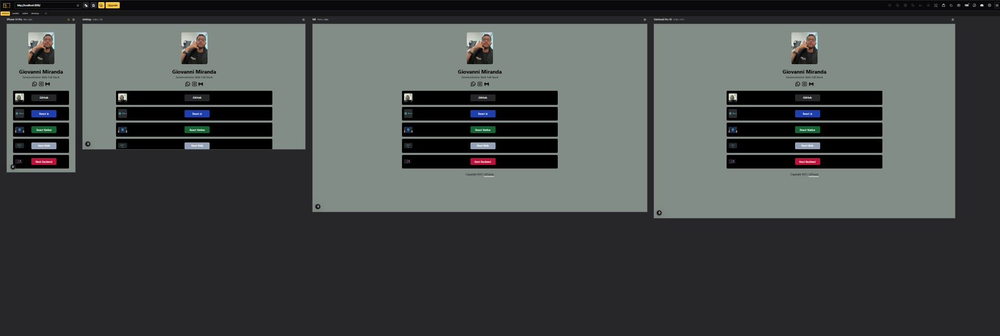

#### Como ficou o projeto




#### Rodar o banco
npx json-server --port 8080 src/service/banco.json

#### Estrategias
    * feth api
    * cadastro
    * animação
    * material designer

#### Usando Material UI
* link ref
```
https://mui.com/material-ui/react-text-field/
```

```
npm install @mui/icons-material
```

```
npm install @mui/material @emotion/react @emotion/styled
```

* layout.tsx
```
suppressHydrationWarning
```